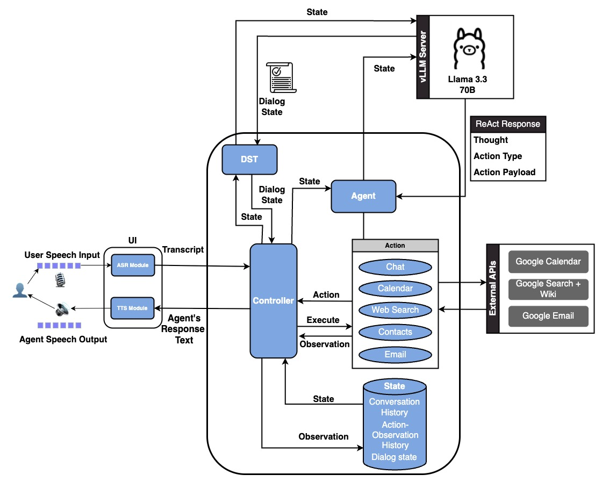

# AURA: Agent for Understanding, Reasoning, and Automated Tool Use

[](https://arxiv.org/abs/2506.23049)
[](#)
[](https://python.org)
[](https://gradio.app)

**AURA** is the first open-source, speech-native assistant capable of completing complex, goal-driven tasks through dynamic tool invocation and multi-turn conversation.



## 🎯 Key Features

- **Speech-Native**: Full speech-to-speech interaction with natural conversation flow
- **Tool Integration**: Dynamic tool invocation for calendar booking, contact lookup, web search, email, and more
- **Multi-Turn Dialogue**: Maintains context across conversation turns for complex task completion
- **Modular Design**: Easy integration of new tools using natural language prompts and action classes
- **Open-Source**: Built entirely with open-weight models (ASR, TTS, LLMs)
- **High Performance**: 92.75% on OpenBookQA (outperforming all open-weight systems), 90% task success on human evaluation

## 🎬 Demo

[](https://www.youtube.com/watch?v=cb7w0GVwwF0)

## 🏗️ System Architecture

AURA employs a cascaded pipeline architecture that combines:
- **ASR (Automatic Speech Recognition)**: Converts speech input to text
- **LLM Agent**: Processes text, reasons about tasks, and decides on tool usage using ReAct-based reasoning
- **TTS (Text-to-Speech)**: Converts agent responses back to natural speech
- **Tool Integration**: Seamless integration with external APIs and services


## 📁 Repository Structure

```
.
├── agent/                      # Core agent implementation
│   ├── actions/                # Action handlers for different tasks
│   │   ├── calendar_action.py  # Calendar booking functionality
│   │   ├── contact_action.py   # Contact lookup
│   │   ├── email_action.py     # Email composition and sending
│   │   ├── web_search_action.py # Web search capabilities
│   │   └── chat_action.py      # General chat functionality
│   ├── controller/             # Agent state and control logic
│   ├── llm/                    # Language model integration
│   ├── agenthub/               # Agent implementations (QA, Chat agents)
│   ├── speech_utils/           # Speech processing utilities
│   ├── dst/                    # Dialog State Tracking components
│   └── secrets_example/        # Example credential configuration
│
├── ui/                         # User interface components
│   ├── local_speech_app.py     # Gradio-based speech interface
│   └── requirements.txt        # UI-specific dependencies
│
├── accent_adaptive_asr/        # Accent-adaptive ASR with fine-tuning
│   ├── asr_ft.py              # ASR fine-tuning script
│   ├── evaluate.py            # ASR evaluation utilities
│   └── config/                # ASR configuration files
│
├── dst/                        # Dialog State Tracking fine-tuning
│   ├── finetune/              # DST model fine-tuning scripts
│   ├── generate/              # DST inference scripts
│   └── evaluation_JGA_DSP/    # DST evaluation metrics
│
├── evaluation/                 # Evaluation frameworks
│   └── voicebench/            # VoiceBench evaluation scripts
│
├── llm_serve/                  # Language model serving utilities
│
├── docs/                       # Documentation and assets
│   └── images/                # System diagrams and screenshots
│
└── environment.yml            # Conda environment configuration
```

## 🚀 Quick Start

### Prerequisites

- Python 3.9+
- Conda or Miniconda
- CUDA-compatible GPU (recommended for optimal performance)

### Installation

1. **Clone the repository**
   ```bash
   git clone https://github.com/Sentientia/Aura.git
   cd Aura
   ```

2. **Create the conda environment**
   ```bash
   conda env create -f environment.yml
   conda activate sentientia
   ```

3. **Set Python path**
   ```bash
   export PYTHONPATH=$PYTHONPATH:$(pwd)
   ```

### Configuration

4. **Set LLM environment variables**
   ```bash
   export LLM_API_KEY="your_api_key_here"
   export LLM_API_BASE="your_api_base_url"
   export LLM_MODEL="your_model_identifier"
   ```

5. **Setup tool credentials** (Required for tool use, optional for chat-only functionality)
   
   - **Google Cloud Platform**: Set up GCP account, enable necessary APIs, and place `credentials.json`
   - Setup credential with the help of examples in agent/secret_examples
   

### Running AURA

6. **Launch the speech interface**
   ```bash
   python ui/local_speech_app.py
   ```


## 📊 Performance

AURA achieves strong performance on multiple benchmarks:

- **VoiceBench OpenBookQA**: 92.75% (outperforming all open-weight systems, approaching GPT-4o)
- **AlpacaEval**: 4.39 (competitive with other open-weight systems)
- **Human Evaluation**: 90% task success rate on complex, multi-turn speech tasks

## 🔧 Adding New Tools

AURA's modular design makes it easy to add new tools:

1. Create a new action class in `agent/actions/`
2. Implement the required methods following the existing action patterns
3. Provide natural language explanation in the agent prompt.
4. Route to appropriate Action class in agent step method.

Example action structure:
```python
from agent.actions.action import Action

class MyCustomAction(Action):
    def __init__(self, thought: str, payload: str):
        super().__init__(thought, payload)
    
    def execute(self, params):
        # Implementation here
        pass
```

## 🔗 Supported Tools

- **📅 Calendar**: Book appointments
- **👥 Contacts**: Look up contact information
- **🔍 Web Search**: Search the web for information
- **📧 Email**: Compose and send emails
- **💬 Chat**: General conversation and question answering


### Getting Help

- Check the [Issues](https://github.com/Sentientia/Aura/issues) page for known problems
- Review the paper for technical details and methodology
- Examine the example configurations in `agent/secrets_example/`
- Raise a new issue if your question is not answered.

## 📚 Research & Development

This project is part of ongoing research in speech-native AI assistants. For detailed technical information, please refer to our paper:

**"AURA: Agent for Understanding, Reasoning, and Automated Tool Use in Voice-Driven Tasks"**  
*Leander Melroy Maben, Gayathri Ganesh Lakshmy, Srijith Radhakrishnan, Siddhant Arora, Shinji Watanabe*

### Human-in-the-Loop Data
Research data and annotations are available at: [Google Sheets](https://docs.google.com/spreadsheets/d/16_DApAlgunmG3pR4f8p9JYjO-v-2m8ZxduN9fZ-AblI/edit?usp=sharing)

## 🤝 Contributing

We welcome contributions! Please feel free to submit issues, feature requests, or pull requests.

## 📄 License

This project is open-source. Please check the repository for license details.

## 📖 Citation

If you use AURA in your research, please cite our paper:

```bibtex
@misc{maben2025auraagentunderstandingreasoning,
      title={AURA: Agent for Understanding, Reasoning, and Automated Tool Use in Voice-Driven Tasks}, 
      author={Leander Melroy Maben and Gayathri Ganesh Lakshmy and Srijith Radhakrishnan and Siddhant Arora and Shinji Watanabe},
      year={2025},
      eprint={2506.23049},
      archivePrefix={arXiv},
      primaryClass={cs.AI},
      url={https://arxiv.org/abs/2506.23049}, 
}
```

## Acknowledgments

We thank the open-source community for the foundational models and tools that made AURA possible, including ESPnet, Transformers, and the broader speech and NLP research community.
