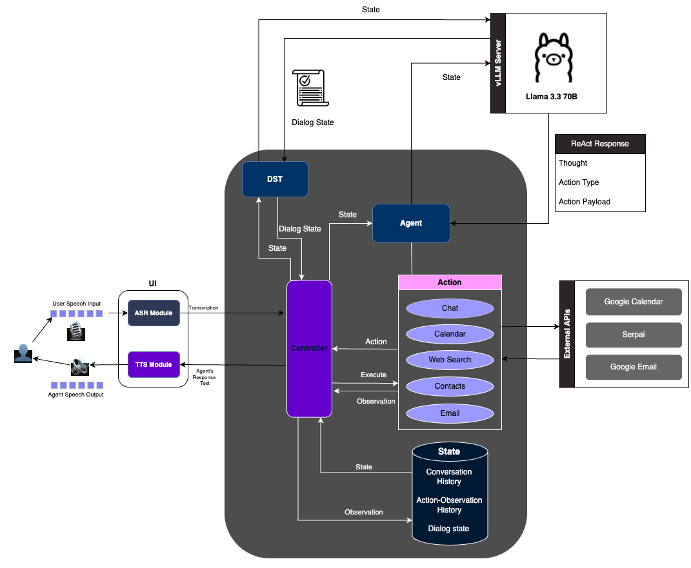

# Aura: Agent for Understanding, Reasoning and Automation

Welcome to the official documentation for Aura, a cascaded voice assistant system that includes Automatic Speech Recognition (ASR), Text-to-Speech (TTS), and a ReAct-based Agent for reasoning and action taking.

## Overview

Aura is designed to be a comprehensive voice assistant system that can understand natural language, reason about user requests, and take appropriate actions. The system is built with a modular architecture that allows for easy extension and customization.

## Demo

[](https://www.youtube.com/watch?v=cb7w0GVwwF0)

## System Architecture



## Key Features

- **Modular Architecture**: Easily extend and customize the system with new components.
- **Multiple Agents**: Choose between different agent implementations for different use cases.
- **Action Framework**: Execute various actions like web search, calendar management, email, and contact management.
- **Speech Interface**: Interact with the system using natural speech with accent-adaptive ASR.
- **Dialog State Tracking**: Keep track of conversation context for more natural interactions.

## Getting Started

To get started with Aura, check out the [Installation](installation.md) guide.

## Repository Structure

```
.
├── agent/                   # Core agent implementation
│   ├── actions/             # Action handlers for different tasks
│   ├── controller/          # Agent state and control logic
│   ├── llm/                 # Language model integration
│   ├── secrets/             # Secure credential storage
│   └── agenthub/            # Agent implementations
│
├── ui/                      # User interface components
│   ├── local_speech_app.py  # Speech interface implementation (using gradio)
│   └── requirements.txt     # UI dependencies
│
├── accent_adaptive_asr/     # Accent-adaptive speech recognition including finetuning
│
├── llm_serve/               # Language model serving script
│
├── dst/                     # Dialog State Tracking. Has the scripts for finetuning LLMs for DST
│
└── environment.yaml         # Conda environment configuration
```
